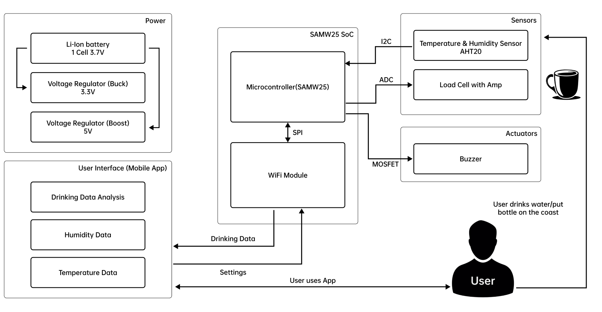
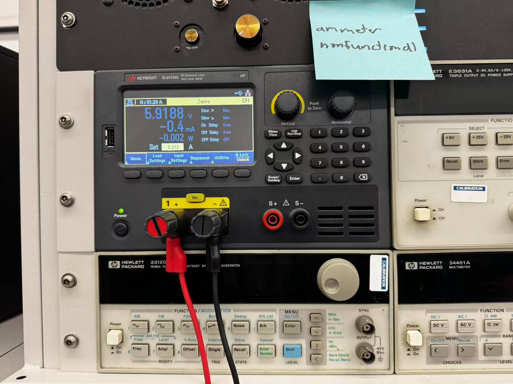
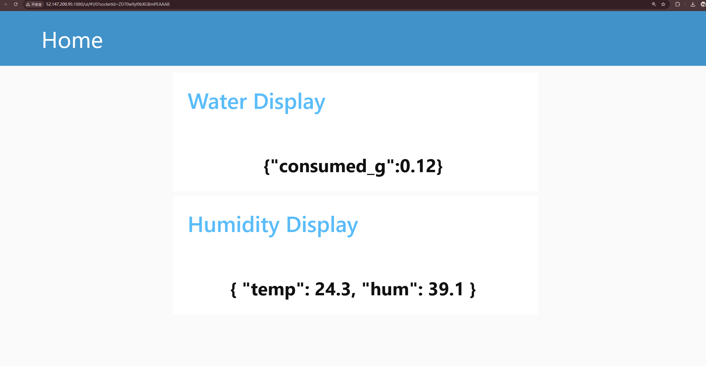
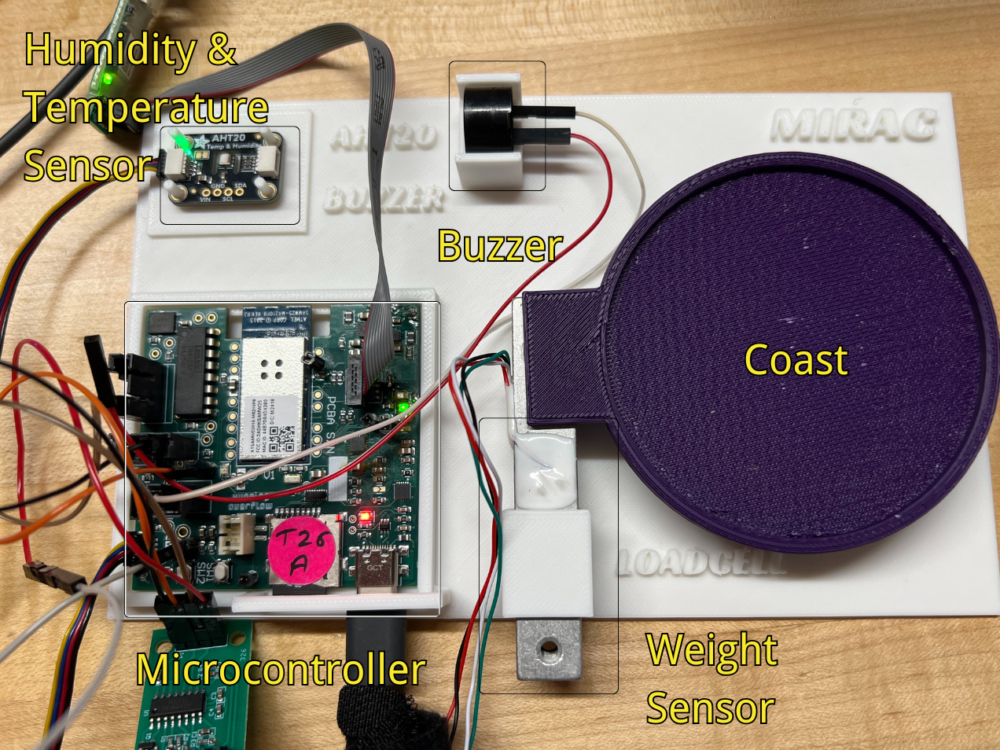
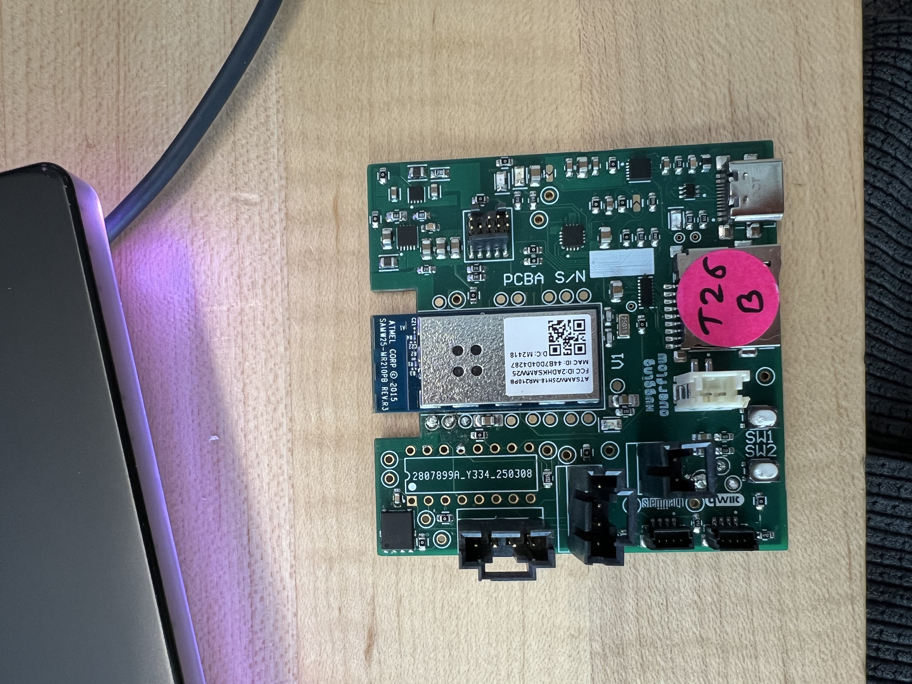
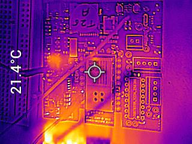
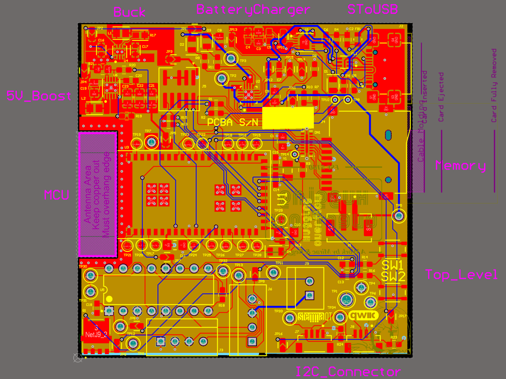
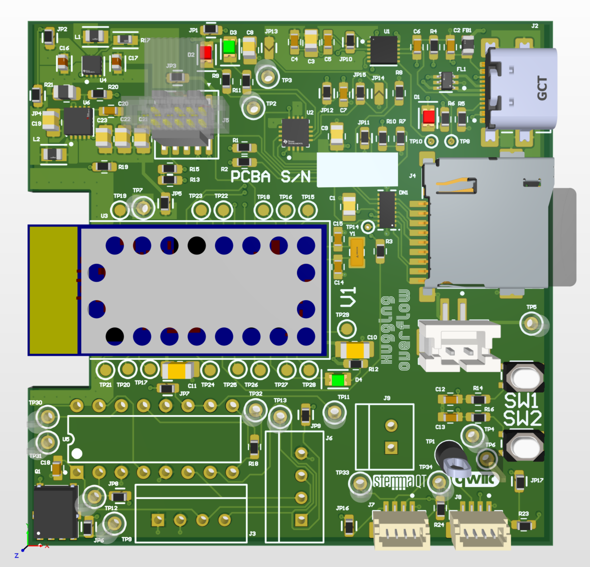
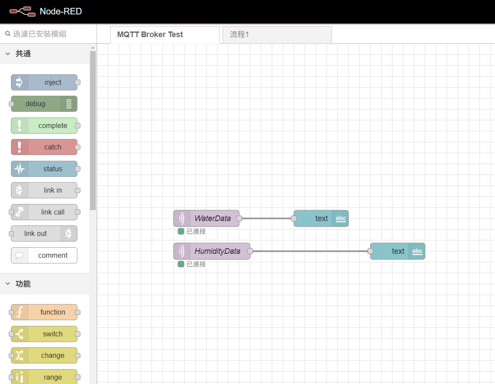

# a14g-final-submission

    * Team Number: 26
    * Team Name: Hugging Overflow
    * Team Members: Jiayang Li, Mubai Luo
    * Github Repository URL: https://github.com/ese5160/a14g-final-submission-s25-t26-hugging-overflow
    * Description of test hardware: (development boards, sensors, actuators, laptop + OS, etc) development boards

# 1. Video Presentation
https://drive.google.com/file/d/1XMepTP3UEeqvNZ6PVvqwsjlHg9IZPP2t/view?usp=drive_link
# 2. Project Summary
## Device Description

* **Give a 2 sentence description of your device.**
  The Smart Coast is an IoT device designed to promote healthy hydration habits and help the user stay hydrated throughout the day to support energy and productivity.

* **What inspired you to do the project? What problem is your device solving?**
  Noticing how easy it is to forget drinking enough water during a busy day—and how dehydration undermines energy and focus—sparked the idea for a smart, automated hydration coach. It tackles the common issue of untracked and irregular water intake by sensing each drink, logging consumption in real time to a mobile app, and alerting users when they’ve gone too long without sipping.

---

## Device Functionality

* **Explain how your Internet-connected device is designed.**

  1. **Data Acquisition & Processing**

     * **ADC Input:** SAMW25 reads amplified load-cell output by ADC to detect water consume behaviors.
     * **I²C Sensor:** SAMW25 polls AHT20 for temperature & humidity data.
     * **On-Board Logic:** Firmware filters readings, identifies “drink events,” and calculates ideal refill intervals.

  2. **Wi-Fi Connectivity**

     * **SPI Link:** SAMW25 controls the Wi-Fi module over SPI.
     * **Data Upload:** After each drink or on a schedule, JSON-formatted payload (timestamp, water volume, temp, humidity) is sent via HTTPS/MQTT to a cloud endpoint.

  3. **Remote Control & Feedback**

     * **Cloud Sync:** User settings (thresholds, alert intervals) are delivered from the cloud back to the SAMW25.
     * **Buzzer Alerts:** If the cup remains idle past the configured interval, SAMW25 drives a MOSFET to trigger the buzzer, closing the feedback loop.

* **System-level block diagram**
  

---

## Challenges

* **Where did you face difficulties? This could be in firmware, hardware, software, integration, etc.**
  The FX1901 loadcell along with INA125P amplifier won't work as expected. The only way to maintain it's functionality is to add a 2.26V bias voltage, which is unacceptable for an IoT product. Besides, the LED strip was much more complex to use than we expected. Because we spent too much time on the loadcell before, we were unable to realize the intended function of the LED within the limited time. Moreover, we mistakenly hided all the designators on our PCBA, which seriously negatively affected the manufacturing process.

* **How did you overcome these challenges?**
  In the last few days before the demo, we decided to replace it with another loadcell. Although it was not as sensitive as expected, it worked fine. Although we weren't able to leverage LED strip, we adjusted the frequency of the buzzer sound to remind users in a more pleasant way. We added all the designators just in time with the assistance of TA.

---

## Prototype Learnings

* **What lessons did you learn by building and testing this prototype?**
  One thing we learned is that we should never procrastinate on a problem for too long. If stuck somewhere, just move forward and focus on other aspects of the project. Also, a more detailed time frame is needed to guarantee everything is settled down on time.

* **What would you do differently if you had to build this device again?**
  We should use a more commonly adopted load cell solution so that even when issues arise, we can find more existing resources and debugging experiences. Additionally, we should pay attention to selecting LEDs that are easy to drive. The Adafruit Neopixel LED strip we previously chose requires complex control and heavily relies on Adafruit's proprietary libraries, making it very difficult to implement on our SAM W25. Therefore, we should use LEDs that are simpler to control and can be driven with just a single GPIO pin.

---

## Next Steps & Takeaways

* **What steps are needed to finish or improve this project?**
  The first step is to add the LED strip to this project, since it should've been the most attractive and good-looking part of the project. Meanwhile, we would like to develop a multiple-coaster system in which the data related to hydration will be synchronized to each coaster. This enables seamless switching among different usage scenarios. In addition, we should develop a custom algorithm that determines our notification behaviors based on the user's past drinking actions combined with temperature and humidity data.

* **What did you learn in ESE5160 through the lectures, assignments, and this course-long prototyping project?**
  The course deepened our understanding of Internet-of-Things products, embedded systems, and the interactions among hardware, firmware, and software; it led us through the whole process from inception of an idea to its implementation. Overall, this has given us greater confidence in developing hardware systems. It showed me that even complex IoT devices can be understood and built in a structured way, and that there are systematic methods for troubleshooting when problems arise.

---

## Project Links

* **Provide a URL to your Node-RED instance for our review (make sure it’s running on your Azure instance!):**
  [Link to Node-RED instance](https://github.com/ese5160/final-project-t26-hugging-overflow/blob/main/flows.json)
  *(Our Node-RED needs to be started manually in PowerShell, so we’ve posted the configuration file to the GitHub repo for your review.)*

* **Provide the share link to your final PCBA on Altium 365:**
  [Link to final PCBA](https://upenn-eselabs.365.altium.com/designs/51AD8762-0D87-4656-9C5B-0941BBEF68CC#design)

# 3. Hardware & Software Requirements
## HRS 01

**The system shall use the SAMW25 as the main microcontroller for processing and Wi-Fi communication.**

* **Finished**

  * The project is based on the SAMW25, which provides overall system control.

---

## HRS 02

**The device shall include a weight sensor (such as HX711) connected via the I2C interface to measure water cup weight changes.**

* **Fixed**

  * The weight sensor doesn’t support an I²C interface, so we introduced an extra humidity & temperature sensor (AHT20), which is connected via the I²C interface.

---

## HRS 03

**The system shall provide real-time reminders using an RGB LED and a buzzer for visual and auditory alerts.**

* **Fixed**

  * We abandoned the LED strip due to its complexity. As compensation, we adjusted the frequency of the buzzer sound to remind users in a more pleasant way.

---

## HRS 04

**The device shall be powered by a single-cell 3.7 V Li-Ion battery, with an onboard voltage regulator to provide 3.3 V to the microcontroller and peripherals.**

* **Finished**

  * The system ran smoothly when powered by a single-cell 3.7 V Li-Ion battery, with an onboard voltage regulator delivering 3.3 V and 5.9 V to the microcontroller and peripherals. Due to a change in the feedback resistor value when designing the power regulator, the 5 V rail became 5.9 V; our tests confirmed this does not affect normal operation of any components.

  

---

## HRS 05

**The hardware shall support Wi-Fi communication for syncing drinking data and receiving app settings.**

* **Partially Finished**

  * All sensors and actuators successfully supported Wi-Fi communication. Due to functional adjustments, we removed the “receive app settings” feature from our project.
  * See the demo video for supporting evidence.

---

## HRS 06

**The system shall include a battery management circuit to ensure safe charging and operation of the Li-Ion battery.**

* **Finished**

  * Please refer to HRS 04 for details on the battery management and voltage regulation.

## SRS 01

**The software shall read real-time data from the weight sensor via the I²C interface to track water consumption.**

* **Fixed**

  * The software reads real-time data from both the weight sensor via ADC and the humidity & temperature sensor via the I²C interface.

---

## SRS 02

**The software shall calculate the amount of water consumed after each drinking action and log the timestamp.**

* **Fixed**

  * The weight sensor accurately detects the mass change of the water cup each time the cup is removed from the coaster.
  * Removed timestamp logging.

---

## SRS 03

**The system shall send drinking data (time and amount) to the mobile app via Wi-Fi after each drinking action.**

* **Fixed**

  * Removed timestamp from the payload.
  * Drinking amount is sent; see the Node-RED dashboard below for confirmation.

  

---

## SRS 04

**The software shall receive hydration goal settings from the mobile app and update the device's behavior accordingly.**

* **Finished**

  * The system adjusts the hydration interval dynamically according to the humidity and temperature data received from the sensor.

---

## SRS 05

**The system shall trigger LED and buzzer reminders when a hydration interval is missed.**

* **Partially Finished**

  * The system now only triggers buzzer reminders; the LED strip was removed due to its complexity and time constraints.
  * See the demo video for evidence.

---

## SRS 06

**The system shall send push notifications via the app when a hydration reminder is triggered.**

* **Abandoned**

  * The buzzer alone is deemed sufficient to alert the user to drink water.

---

## SRS 07

**The software shall enter a low-power mode when idle to conserve battery life.**

* **Abandoned**

  * The system’s baseline consumption is low enough that additional low-power modes were not implemented.

# 4. Project Photos & Screenshots
## The Full Project

*SmartCoast deployed in the field*

---

## System-Level Block Diagram

*Power, sensors, SoC, and user interface*

---

## Standalone PCBA Views

*Top side of the PCB assembly*

*Bottom side of the PCB assembly*

---

## Thermal Images Under Load

*Thermal camera view during operation*

---

## Altium Board Designs

*2D layout in Altium Designer*

*3D render of the PCB*

---

## Node-RED Interfaces

*Real-time data dashboard in Node-RED*

*Flow logic in the Node-RED backend*

---

# Codebase
* [Link to the final embedded C firmware codebases](https://github.com/ese5160/final-project-t26-hugging-overflow)
* [Link to Node-RED dashboard code](https://github.com/ese5160/final-project-t26-hugging-overflow/blob/main/flows.json)

Our node-red needs to be started manually in PowerShell, so we post the configuration file to the Github repo for your review.

